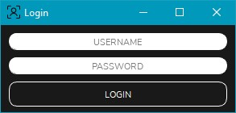
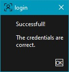
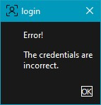

# Login Example

> A simple but comprehensive example of a login window

***SUCCESSFUL LOGIN***

***BAD CREDENTIALS***

## Installation

You can either study this code and implement your own copy of it on your program, or
just copy paste this, either way you should know how this works in order to make a good
GUI.

### Clone

- Clone this repo to your local machine using `https://github.com/Eptor/Login-Example`

## Contributing

> To get started...

### Step 1

- **Option 1**
    - 🍴 Fork this repo!

- **Option 2**
    - 👯 Clone this repo to your local machine using `https://github.com/Eptor/Login-Example/compare/.git`

### Step 2

- **HACK AWAY!** 🔨🔨🔨

### Step 3

- 🔃 Create a new pull request using <a href="https://github.com/Eptor/Login-Example/compare/" target="_blank">`https://github.com/Eptor/Login-Example/compare/"`</a>.

## License

- **[GPL v3 license](http://opensource.org/licenses/)**
- Copyright 2020 © Eptor.
